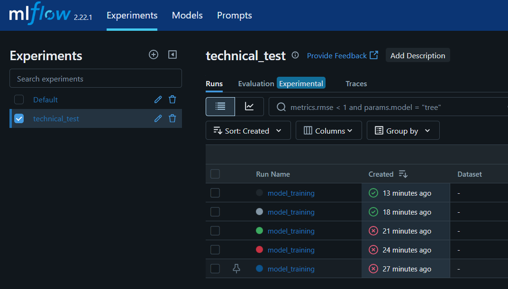

# **Technical test**

## **Nota Bene**
All the functions implemented to create the different pipelines can be found in the [`src`](src)

The logic behind the choices made will often be written in the functions' docstrings.

## **1 - Set up your environment**

In your terminal run the following commands : 

```bash
conda env create -f environment.yml
conda activate technical_test
```

## **2 - ETL pipeline : load the necessary data**

Create your instances & labels by executing the following notebook : [`notebooks/etl_pipeline.ipynb`](notebooks/etl_pipeline.ipynb)

## **3 - ML pipeline : preprocess the data and train you model**

Want to see the logic behind the pre-processing step ? Go to : [`notebooks/exploration_for_preprocessing.ipynb`](notebooks/exploration_for_preprocessing.ipynb)


### **Model training & experiment tracking**

Start by executing the following command in your terminal :

```bash
mlflow ui
```

And click on the printed link to acces the mlflow UI.

Then go to the following link : [`notebooks/ml_pipeline.ipynb`](notebooks/ml_pipeline.ipynb) and execute all the cells

After executing all the cells go to the Mlflow UI and you shoud be able to see your experiment : 



Now if you click on the latest `model_training` run you will be able to see all the run information such as : all the parameters used throughout the execution, the training metrics,...

Then if you go to the `Artifact` tab you'll find the model (model_artifacts), the classification reports (model_evaluation) and the shap dependence plots & importance variables plot (model_explanation).
